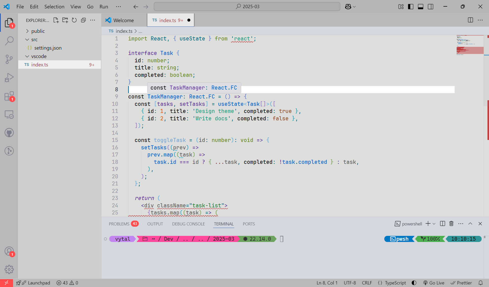

# Vytalitech Light

[](https://marketplace.visualstudio.com/items?itemName=vytalitech.vytalitech)
[](https://marketplace.visualstudio.com/items?itemName=vytalitech.vytalitech)
[](https://marketplace.visualstudio.com/items?itemName=vytalitech.vytalitech)
[](https://github.com/vytalitech/vytalitech-light)

A sleek, light-grey VS Code theme built for maximum zen and readability.

---

## Theme Preview

[](images/screenshot.png)  
<sub>Click the image to zoom in and view full-size.</sub>

---

## Installation

[](https://marketplace.visualstudio.com/items?itemName=vytalitech.vytalitech)

<strong>&nbsp;&nbsp;&nbsp;&nbsp;or</strong>

**Option 1:** Search for `Vytalitech Light` in the **Extensions Marketplace** and click **Install**.  
**Option 2:** [Download the latest `.vsix` release](https://marketplace.visualstudio.com/items?itemName=vytalitech.vytalitech) and install manually:

1. Open the Command Palette (`Ctrl+Shift+P`)
2. Run `Extensions: Install from VSIX...`
3. Select the downloaded file

---

## Features

- Light grey base for minimal eye strain
- Informative color palette (no aggressive red tones)
- Fully styled:
  - Tabs
  - Status bar
  - Explorer
  - Command palette
  - Breadcrumbs
  - IntelliSense / Suggestions
- Designed for primarily for **JavaScript** and **TypeScript**.

## Extras

### Terminal Font

I'm using [`CaskaydiaMono Nerd Font`](https://github.com/ryanoasis/nerd-fonts/releases/download/v3.3.0/CascadiaMono.zip) with full icon support (great for powerlines and Oh My Posh prompts). If you prefer not to download the zip here, visit this website and search for it there: (https://www.nerdfonts.com/font-downloads)

> Download the `.zip`, extract it, install the font on your system, and set this in your 'settings.json':
>
> ```json
> "terminal.integrated.fontFamily": "CaskaydiaMono Nerd Font"
> ```

### Editor Font

For the editor, I am using [`FiraCode Nerd Font`](https://github.com/ryanoasis/nerd-fonts/releases/download/v3.3.0/FiraCode.zip) — it's an extension of Fira Mono font. If you prefer not to download the zip here, visit this website and search for it there: (https://www.nerdfonts.com/font-downloads)

> Download the `.zip`, extract it, install the font, and set this in your `settings.json`:
>
> ```json
> "editor.fontFamily": "FiraCode Nerd Font Propo, monospace"
> ```

## Dev Mode

Clone and run with:

```bash
git clone https://github.com/vytalic/vytalitech-light.git
cd vytalitech-light
code .
```
