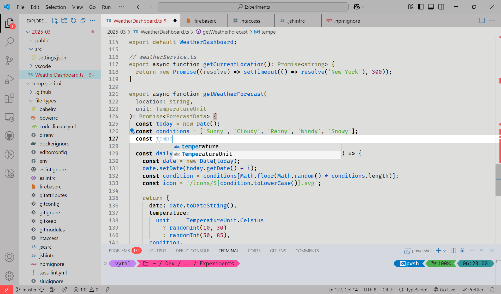

# Vytalitech Light

[](https://marketplace.visualstudio.com/items?itemName=vytalitech.vytalitech-light)
[](https://marketplace.visualstudio.com/items?itemName=vytalitech.vytalitech-light)
[](https://marketplace.visualstudio.com/items?itemName=vytalitech.vytalitech-light)
[](https://github.com/vytalitech/vytalitech-light)

A sleek, light-grey VS Code theme built for maximum zen and readability.

---

## Theme Preview

[](images/screenshot.png)  
<sub>Click the image to zoom in and view full-size.</sub>

---

## Installation

**Option 1:** Search for `Vytalitech Light` in the **Extensions Marketplace** and click **Install**.  
**Option 2:** [Download the latest `.vsix` release](https://marketplace.visualstudio.com/items?itemName=vytalitech.vytalitech) and install manually:

1. Open the Command Palette (`Ctrl+Shift+P`)
2. Run `Extensions: Install from VSIX...`
3. Select the downloaded file

---

## Features

- Light grey base for minimal eye strain
- Informative color palette (no aggressive red tones)
- Fully styled:
  - Tabs
  - Status bar
  - Explorer
  - Command palette
  - Breadcrumbs
  - IntelliSense / Suggestions
- Designed for **JavaScript**, **TypeScript**, **HTML**, **CSS**, and more

## Dev Mode

Clone and run with:

```bash
git clone https://github.com/vytalic/vytalitech-light.git
cd vytalitech-light
code .
```
